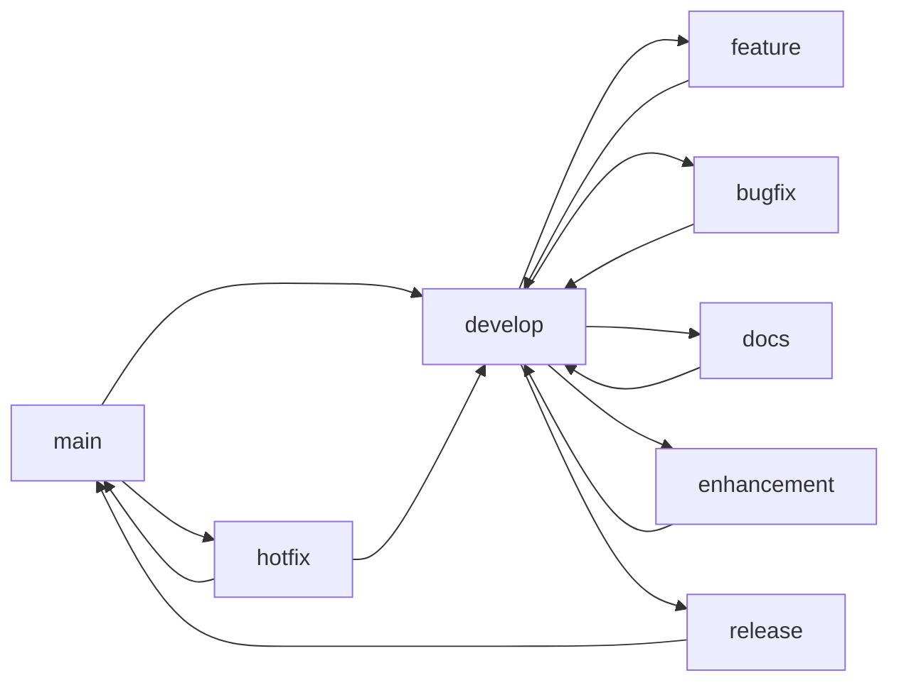

# 🌿 Git Branching Strategy

## Overview

This document defines the branching strategy for the Python Learning Repository.

---

## 📋 Branch Types

### 1. **main** (Protected)
- **Purpose:** Production-ready, stable code
- **Status:** ✅ Exists
- **Protection:** Always deployable, tested code only
- **Direct Commits:** ❌ No (PRs only)

### 2. **develop** (Primary Development)
- **Purpose:** Integration branch for features
- **Status:** ⚠️ Needs creation
- **Protection:** Tested code before merging to main
- **Direct Commits:** ❌ No (PRs required)

### 3. **feature/** (New Features)
- **Purpose:** Developing new features
- **Pattern:** `feature/<description>`
- **Examples:**
  - `feature/add-docker-support`
  - `feature/add-validation-utils`
  - `feature/add-examples-docs`

### 4. **bugfix/** (Bug Fixes)
- **Purpose:** Fixing bugs from issues
- **Pattern:** `bugfix/<issue-number>-<description>`
- **Examples:**
  - `bugfix/66-guess-number-validation`
  - `bugfix/67-rps-input-validation`
  - `bugfix/101-fastapi-datetime`

### 5. **docs/** (Documentation)
- **Purpose:** Documentation improvements
- **Pattern:** `docs/<description>`
- **Examples:**
  - `docs/add-troubleshooting-guide`
  - `docs/add-code-examples`
  - `docs/update-readme`

### 6. **enhancement/** (Improvements)
- **Purpose:** Code quality improvements
- **Pattern:** `enhancement/<description>`
- **Examples:**
  - `enhancement/add-type-hints`
  - `enhancement/add-docstrings`
  - `enhancement/optimize-algorithms`

### 7. **release/** (Release Preparation)
- **Purpose:** Preparing releases
- **Pattern:** `release/v<major>.<minor>.<patch>`
- **Examples:**
  - `release/v1.0.0`
  - `release/v1.1.0`

### 8. **hotfix/** (Critical Fixes)
- **Purpose:** Urgent production fixes
- **Pattern:** `hotfix/<description>`
- **Examples:**
  - `hotfix/security-path-traversal`
  - `hotfix/critical-data-loss`

### 9. **experiment/** (Learning/Testing)
- **Purpose:** Experimental features, learning
- **Pattern:** `experiment/<description>`
- **Examples:**
  - `experiment/add-gui-examples`
  - `experiment/add-async-examples`

---

## 🔄 Branch Workflow



---

## 📝 Branch Naming Conventions

| Type | Pattern | Example |
|------|---------|---------|
| Feature | `feature/<kebab-case>` | `feature/add-docker-support` |
| Bugfix | `bugfix/<issue>-<desc>` | `bugfix/66-input-validation` |
| Documentation | `docs/<kebab-case>` | `docs/add-examples` |
| Enhancement | `enhancement/<kebab-case>` | `enhancement/type-hints` |
| Release | `release/v<major>.<minor>` | `release/v1.0.0` |
| Hotfix | `hotfix/<kebab-case>` | `hotfix/security-fix` |
| Experiment | `experiment/<kebab-case>` | `experiment/gui-examples` |

---

## 🚀 Creating Branches

### From Issue

```bash
# For feature from issue #100
git checkout develop
git pull origin develop
git checkout -b feature/100-add-validation-utils

# For bugfix from issue #66
git checkout develop
git pull origin develop
git checkout -b bugfix/66-guess-number-validation
```

### For Documentation

```bash
git checkout develop
git pull origin develop
git checkout -b docs/add-troubleshooting-guide
```

---

## ✅ Merge Requirements

### All Branches → develop/main

- [ ] Code compiles without errors
- [ ] Tests pass (if applicable)
- [ ] No security vulnerabilities introduced
- [ ] Documentation updated (if needed)
- [ ] Issue referenced in commit message
- [ ] Code reviewed (for PRs)

### Feature Branches

- [ ] Feature complete
- [ ] Examples added
- [ ] README updated

### Bugfix Branches

- [ ] Bug reproduced and fixed
- [ ] Test case added (if possible)
- [ ] Issue number in commit

### Documentation Branches

- [ ] Spelling/grammar checked
- [ ] Links verified
- [ ] Examples tested

---

## 📊 Branch Priority

| Priority | Branch Type | Merge Target |
|----------|-------------|--------------|
| 🔴 Critical | hotfix/* | main immediately |
| 🟡 High | bugfix/* | develop → main |
| 🟢 Medium | feature/* | develop → main |
| 🔵 Low | docs/*, enhancement/* | develop → main |
| ⚪ Experimental | experiment/* | May not merge |

---

## 🎯 Recommended Branches to Create

### Immediate (Week 1)

1. **develop** - Primary development branch
2. **bugfix/66-guess-number-validation** - Fix input crash
3. **bugfix/67-rps-input-validation** - Fix RPS crash
4. **docs/add-troubleshooting-guide** - Add error guide

### Short-term (Week 2-3)

5. **enhancement/add-type-hints** - Add type hints
6. **enhancement/add-docstrings** - Add documentation
7. **feature/add-validation-utils** - Create utils module
8. **feature/add-docker-support** - Docker configuration

### Medium-term (Month 1-2)

9. **feature/add-code-examples** - Examples for all concepts
10. **feature/add-integration-tests** - Test suite
11. **release/v1.0.0** - First stable release

### Long-term (Month 3+)

12. **experiment/add-gui-examples** - GUI learning
13. **experiment/add-async-examples** - Async Python
14. **feature/add-advanced-llm** - More LLM examples

---

## 📁 Branch Protection Rules

### main
- [x] Require PR review
- [ ] Require status checks (tests)
- [ ] Require up-to-date branch
- [x] Include administrators

### develop
- [ ] Require PR review
- [ ] Require status checks
- [ ] Allow direct commits from maintainers

---

## 🔗 Related Documents

- [CONTRIBUTING.md](CONTRIBUTING.md)
- [PROJECT_REVIEW.md](PROJECT_REVIEW.md)
- [GitHub Issues](https://github.com/hackdartstorm/Python/issues)

---

**Status:** 📋 Strategy defined, branches pending creation
**Last Updated:** February 19, 2026
